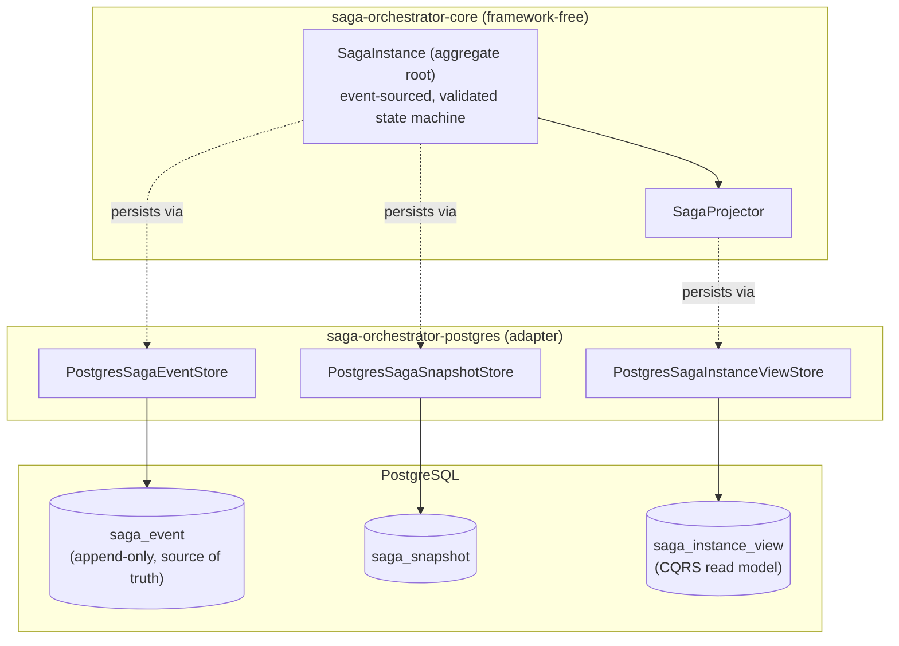

# Distributed Saga Orchestrator

An event-sourced, CQRS-backed saga orchestration engine built in Java, designed to coordinate multi-step distributed transactions with automatic compensation on failure — without any participant service ever needing to know about the others.

> **Status:** Core domain model, PostgreSQL persistence, and the initial Milestone 3 payment participant integration are implemented and tested. The messaging layer now includes a transport-agnostic payment handler, inbox/outbox-backed reply flow, and a saga orchestrator boundary that advances saga state from participant replies — see [Current Implementation Status](#current-implementation-status) and [Roadmap](#roadmap).

## Motivation

The Saga pattern is the standard answer to "how do you keep data consistent across multiple services without a distributed transaction," but most explanations stop at the sequence diagram. This project exists to actually build the hard, easy-to-get-wrong parts underneath that diagram:

- What does it really mean for a workflow's state to be *derived* from its event history, rather than stored and overwritten?
- How do you guarantee two concurrent writers can never silently corrupt the same in-flight saga?
- How do you keep a read-optimized dashboard view consistent with a write-optimized event log, without introducing eventual-consistency bugs you can't reason about?
- How do you version a long-running workflow definition without breaking sagas that are already mid-flight against an older version?

Every decision below is documented with the alternative that was considered and rejected, not just the one that was chosen — see [`docs/design-decisions.md`](./docs/design-decisions.md).

## Key Features

**Implemented:**
- Event-sourced saga aggregate with a validated, exhaustively-checked state machine
- Sealed, closed domain event vocabulary (compiler-enforced exhaustiveness, not a runtime assumption)
- Optimistic concurrency control, verified under real concurrent load with multiple racing writer threads
- CQRS: a denormalized, query-optimized read model kept transactionally consistent with the event log
- Snapshotting for fast rehydration of long-running sagas, with schema-version-aware invalidation
- Saga definition versioning — an in-flight saga always keeps executing against the exact definition version it started with, even if a newer version is deployed underneath it
- A framework-free domain core (zero Spring/JDBC/Jackson dependency) backed by a PostgreSQL adapter module implementing every persistence port
- 62 tests: 53 run with zero external dependencies; 9 are Testcontainers-backed integration tests against a real, ephemeral PostgreSQL instance
- Payment participant domain, command handler, outbox-backed reply emission, and saga reply consumption via a new orchestrator boundary

**Designed, not yet built** (see [Roadmap](#roadmap)):
- Kafka-based command/reply messaging between the orchestrator and independent participant services
- Outbox/Inbox patterns for exactly-once-effect delivery over an at-least-once transport
- REST API, timeout handling, and distributed tracing across service boundaries

## Architecture Overview



The domain module (`saga-orchestrator-core`) defines every persistence need as a plain Java interface — `SagaEventStore`, `SagaSnapshotStore`, `SagaInstanceViewStore`, `TransactionRunner` — and has no idea PostgreSQL exists. `saga-orchestrator-postgres` is the only module that does. This is Clean/Hexagonal Architecture applied literally: the entire domain model is unit-testable with pure in-memory fakes, and a different persistence technology would mean writing a new adapter, never touching the domain.

Full diagrams (module dependencies, the saga state machine, the event-sourcing write path, CQRS flow, and optimistic concurrency) are in [`docs/architecture.md`](./docs/architecture.md).

## Technology Stack

| Layer | Technology |
|---|---|
| Language | Java 21 |
| Build | Gradle (Kotlin DSL) |
| Domain persistence (write side) | PostgreSQL — hand-rolled event store, no ORM |
| Serialization | Hand-written JSON serializer (JSONB payload column) |
| Testing | JUnit 5, Testcontainers (PostgreSQL) |
| Planned (Milestone 3) | Apache Kafka, Protobuf, Spring Boot |

No ORM is used on the write side deliberately — an event-sourced append-only log and a JPA-style entity-mapping tool solve different problems, and forcing the former through the latter tends to fight the tool rather than use it.

## Project Structure

```
saga-orchestrator/
├── saga-orchestrator-core/       Framework-free domain model (see docs/module-overview.md)
├── saga-orchestrator-postgres/   PostgreSQL adapter implementing the core's persistence ports
├── docs/
│   ├── architecture.md           Mermaid diagrams: system, modules, state machine, event flow, CQRS
│   ├── design-decisions.md       Every significant decision, with rejected alternatives
│   ├── module-overview.md        Package-by-package breakdown of both modules
│   └── roadmap.md                Implemented vs. planned, including the approved Milestone 3 design
├── .github/                      CI workflow, issue templates, PR template
├── settings.gradle.kts
├── LICENSE
└── CONTRIBUTING.md
```

## Getting Started

### Prerequisites

- JDK 21
- Docker (only required to run the PostgreSQL integration test suite via Testcontainers — the domain model's unit tests need nothing beyond the JDK)
- A Gradle wrapper is not currently checked into this repository (see [Manual Steps](#manual-steps-before-publishing) below for how to add one) — a local Gradle 8.x install works in the meantime.

### Build and test

```bash
git clone https://github.com/jemsheena/saga-orchestrator.git
cd saga-orchestrator

# Run the framework-free domain model's unit tests (no Docker required)
gradle :saga-orchestrator-core:test

# Run the PostgreSQL adapter's tests, including Testcontainers integration tests
# (requires a local Docker daemon)
gradle :saga-orchestrator-postgres:test

# Build everything
gradle build
```

## Example Workflow

The snippet below shows the full lifecycle this repository actually implements today: defining a saga, starting an instance, advancing it through steps, and persisting it with full concurrency protection. (There is no REST API yet — this is the programmatic core API a future REST/Kafka layer will sit on top of.)

```java
// 1. Define the workflow once, at startup
SagaDefinition orderFulfillment = SagaDefinition.builder("OrderFulfillment")
        .addStep(new SagaStep("ChargePayment", "ChargePaymentCommand", "RefundPaymentCommand"))
        .addStep(new SagaStep("ReserveInventory", "ReserveInventoryCommand", "ReleaseInventoryCommand"))
        .addStep(new SagaStep("ShipOrder", "ShipOrderCommand", null)) // not compensatable
        .build();

registry.register(orderFulfillment);

// 2. Start a new instance
SagaInstance saga = SagaInstance.start(orderFulfillment);
repository.save(saga, EventMetadata.newCorrelation());

// 3. Report step outcomes as participants respond
SagaInstance loaded = repository.findById(saga.sagaId()).orElseThrow();
loaded.completeCurrentStep(orderFulfillment, "ChargePayment");
repository.save(loaded, EventMetadata.newCorrelation());

// 4. A later step fails -> automatic compensation kicks in
SagaInstance midFlight = repository.findById(saga.sagaId()).orElseThrow();
midFlight.failCurrentStep(orderFulfillment, "ShipOrder", "Carrier API timeout");
repository.save(midFlight, EventMetadata.newCorrelation());
// state is now COMPENSATING; compensationCursor points at "ReserveInventory" to undo next
```

Every one of these calls appends immutable events, keeps `saga_instance_view` transactionally in sync, and enforces optimistic concurrency automatically — none of that is visible at this call site, which is the point.

## Current Implementation Status

| Component | Status |
|---|---|
| Saga domain model (definitions, steps, state machine) | ✅ Implemented, unit tested |
| Domain events + event sourcing | ✅ Implemented, unit tested |
| PostgreSQL event store, optimistic concurrency | ✅ Implemented, integration tested |
| CQRS read model + synchronous projection | ✅ Implemented, integration tested |
| Snapshotting | ✅ Implemented, unit + integration tested |
| REST API | ❌ Not implemented |
| Kafka messaging / Outbox / Inbox | ✅ Implemented for payment participant command/reply flow using the existing abstractions |
| Participant services (payment, inventory, shipping) | ⚠️ Payment participant implemented; inventory/shipping remain planned |
| Distributed tracing | ❌ Not implemented |

## Roadmap

See [`docs/roadmap.md`](./docs/roadmap.md) for the full, detailed roadmap, including the reviewed and approved Kafka messaging architecture for Milestone 3 (topology, partitioning strategy, Outbox/Inbox design, timeout handling) — none of which is implemented yet, but all of which has already been through a design review.

## Future Improvements

- Kafka-based distributed messaging between orchestrator and participants (Milestone 3)
- REST API for starting/querying sagas
- OpenTelemetry distributed tracing across service boundaries
- A read-only dashboard service querying the CQRS view

## Contributing

Contributions, issues, and design critiques are welcome — see [`CONTRIBUTING.md`](./CONTRIBUTING.md).

## License

Licensed under the [MIT License](./LICENSE).
