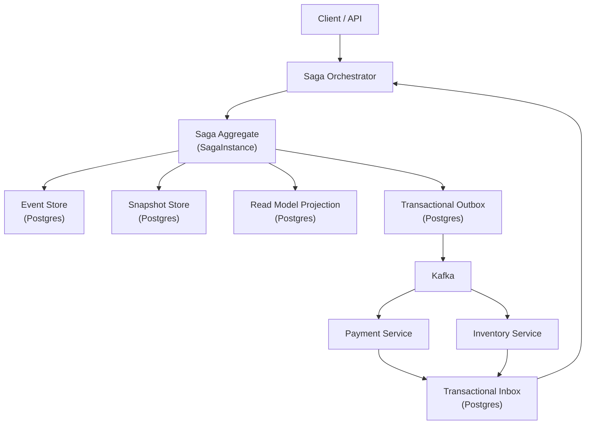

# Distributed Saga Orchestrator

A production-grade Saga orchestration engine built in Java with event sourcing, CQRS, transactional outbox/inbox, retry/DLQ, timeout scheduling, and Kafka integration.

> **Status:** Production-grade Saga Orchestrator core implemented.
>
> Implemented:
> - Event Sourcing
> - CQRS
> - DDD
> - Hexagonal Architecture
> - PostgreSQL Event Store
> - Snapshotting
> - Transactional Outbox
> - Transactional Inbox
> - Kafka Integration
> - Retry Policies
> - Dead Letter Queue
> - Timeout Scheduler
> - Metrics
> - Integration Tests
>
> Current Focus:
> - Serialization & Schema Evolution (Milestone 9)

## Why this project exists

Distributed transactions are hard. The Saga pattern is the practical alternative to two-phase commit, but the hard part is building infrastructure that is safe, consistent, and observable.

This project focuses on the real implementation challenges:

- preserving saga state as immutable event history
- making concurrent saga updates safe with optimistic locking
- keeping a read-optimized view consistent with the write-side event log
- handling retries, dead letters, and timeouts without corrupting workflow state
- keeping participant services independent and stateless

## Core Features

- Event Sourcing
- CQRS
- Domain-Driven Design (DDD)
- Hexagonal Architecture
- Optimistic Locking
- Snapshotting
- Transactional Outbox
- Transactional Inbox
- Kafka Integration
- Retry Policies
- Dead Letter Queue
- Timeout Scheduler
- PostgreSQL Adapter
- Metrics
- Testcontainers Integration
- Java 21

## Planned Features

- REST API layer
- Distributed tracing / OpenTelemetry
- Schema evolution tooling and upcasters
- Production deployment documentation
- Developer-facing sample application

## Architecture Overview


```mermaid
flowchart TB
    Client["Client / API"]
    Orchestrator["Saga Orchestrator"]
    SagaAggregate["Saga Aggregate\n(SagaInstance)"]
    EventStore["Event Store\n(Postgres)"]
    SnapshotStore["Snapshot Store\n(Postgres)"]
    Projection["Read Model Projection\n(Postgres)"]
    Outbox["Transactional Outbox\n(Postgres)"]
    Kafka["Kafka"]
    Payment["Payment Service"]
    Inventory["Inventory Service"]
    Inbox["Transactional Inbox\n(Postgres)"]

    Client --> Orchestrator
    Orchestrator --> SagaAggregate
    SagaAggregate --> EventStore
    SagaAggregate --> SnapshotStore
    SagaAggregate --> Projection
    SagaAggregate --> Outbox
    Outbox --> Kafka
    Kafka --> Payment
    Kafka --> Inventory
    Payment --> Inbox
    Inventory --> Inbox
    Inbox --> Orchestrator
```

The core domain is framework-free. Adapters implement persistence and messaging without leaking infrastructure into the domain layer.

## Technology Stack

| Layer | Technology |
|---|---|
| Language | Java 21 |
| Build | Gradle |
| Persistence | PostgreSQL |
| Messaging | Kafka |
| Metrics | Micrometer |
| Testing | JUnit 5, Testcontainers |
| Serialization | Jackson |
| Architecture | DDD, CQRS, Hexagonal Architecture |
| Containerization | Docker |

## Project Structure

```
saga-orchestrator/
├── saga-orchestrator-core/       Core domain model and saga engine
├── saga-orchestrator-postgres/   PostgreSQL persistence adapters
├── saga-orchestrator-messaging/  Messaging, outbox/inbox, Kafka adapters
├── participant-payment-service/ Payment participant reference implementation
├── docs/                        Architecture, design decisions, roadmap
├── LICENSE
├── CONTRIBUTING.md
├── settings.gradle.kts
└── gradlew*
```

## Quick Start

```bash
cd saga-orchestrator
./gradlew :saga-orchestrator-core:test
./gradlew :saga-orchestrator-postgres:test
./gradlew build
```

> Windows: use `gradlew.bat`

## Example Usage

This repository currently exposes a programmatic saga engine and persistence plumbing. A future API layer will build on top of these primitives.

```java
SagaDefinition orderFulfillment = SagaDefinition.builder("OrderFulfillment")
        .addStep(new SagaStep("ChargePayment", "ChargePaymentCommand", "RefundPaymentCommand"))
        .addStep(new SagaStep("ReserveInventory", "ReserveInventoryCommand", "ReleaseInventoryCommand"))
        .addStep(new SagaStep("ShipOrder", "ShipOrderCommand", null))
        .build();

registry.register(orderFulfillment);

SagaInstance saga = SagaInstance.start(orderFulfillment);
repository.save(saga, EventMetadata.newCorrelation());

SagaInstance loaded = repository.findById(saga.sagaId()).orElseThrow();
loaded.completeCurrentStep(orderFulfillment, "ChargePayment");
repository.save(loaded, EventMetadata.newCorrelation());
```

## Implemented Architecture

This project currently implements:

- Event Sourcing with immutable domain events
- CQRS with a write-side event log and read-side projection
- DDD aggregate consistency and business-rule encapsulation
- Hexagonal Architecture with clear ports/adapters
- Optimistic concurrency control in the event store
- Snapshotting for fast saga recovery
- Transactional outbox for dual-write safety
- Transactional inbox for deduplicated message handling
- Kafka integration for distributed participant communication
- Retry policies and dead-letter queue support
- Timeout scheduler support for long-running workflows

## Current Implementation Status

| Component | Status |
|---|---|
| Event Sourcing | ✅ |
| CQRS | ✅ |
| PostgreSQL Event Store | ✅ |
| Snapshotting | ✅ |
| Outbox Pattern | ✅ |
| Inbox Pattern | ✅ |
| Kafka Integration | ✅ |
| Retry Policy | ✅ |
| Dead Letter Queue | ✅ |
| Timeout Scheduler | ✅ |
| Metrics | ✅ |
| Integration Tests | ✅ |
| REST API | ❌ |
| Distributed Tracing | ❌ |
| Schema Evolution | 🚧 |

## Roadmap

- ✅ Milestone 1 — Core Event Sourcing
- ✅ Milestone 2 — CQRS
- ✅ Milestone 3 — Saga Engine
- ✅ Milestone 4 — Timeout Scheduler
- ✅ Milestone 5 — Transactional Outbox
- ✅ Milestone 6 — Transactional Inbox
- ✅ Milestone 7 — Retry & Dead Letter Queue
- ✅ Milestone 8 — Snapshotting
- 🚧 Milestone 9 — Serialization & Schema Evolution

Planned beyond Milestone 9:
- OpenTelemetry / distributed tracing
- Production hardening and operational documentation
- Developer-facing REST/Kafka service layer

## Documentation

- [`docs/architecture.md`](./docs/architecture.md)
- [`docs/design-decisions.md`](./docs/design-decisions.md)
- [`docs/roadmap.md`](./docs/roadmap.md)
- [`CONTRIBUTING.md`](./CONTRIBUTING.md)

## Contributing

Contributions are welcome. Please open issues for bugs, improvements, or questions, and follow the conventions in `CONTRIBUTING.md`.

## License

Licensed under the MIT License. See `LICENSE`.
