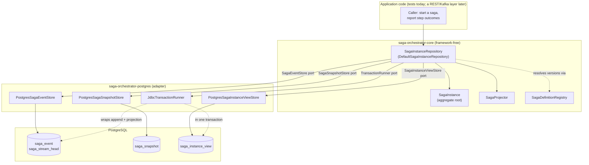
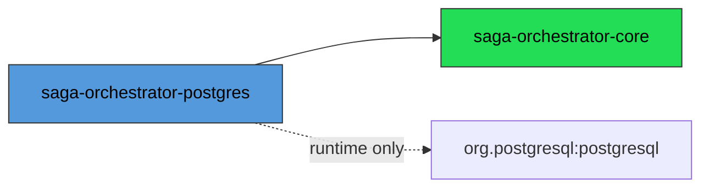
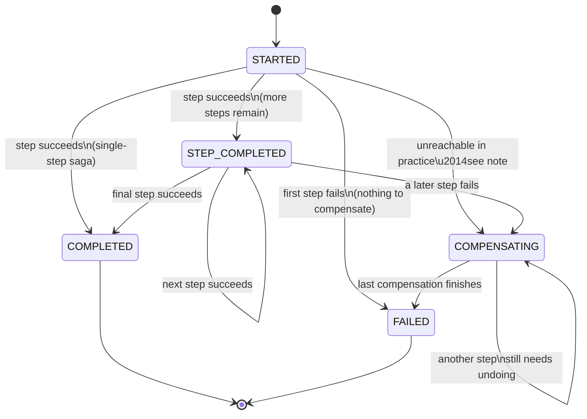
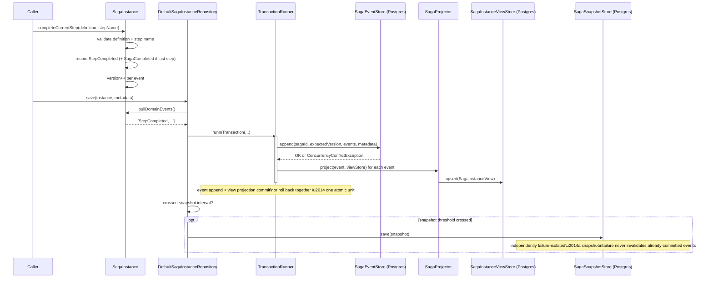
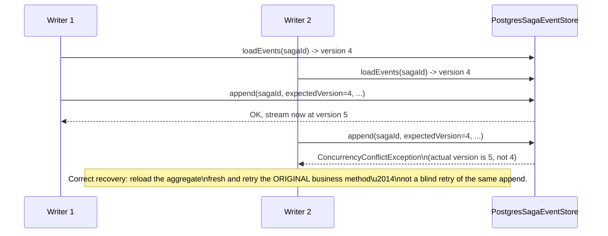

# Architecture

This document describes the architecture **as implemented today** (Milestones 1, 2, and 2.5). For the approved-but-not-yet-built Kafka/messaging architecture, see [`roadmap.md`](./roadmap.md) — nothing in that layer exists in this repository yet, and this document intentionally does not diagram it as current state.

## 1. Overall System Architecture

The system is a two-module Gradle build: a framework-free domain core, and a PostgreSQL adapter that implements the persistence ports the core defines.



**Why this shape:** `saga-orchestrator-core` has zero runtime dependencies — no Spring, no JDBC, no Jackson. It defines ports (`SagaEventStore`, `SagaSnapshotStore`, `SagaInstanceViewStore`, `TransactionRunner`, `SagaDefinitionRegistry`) as plain interfaces; `saga-orchestrator-postgres` is the only module that knows PostgreSQL exists. This is a direct application of Clean Architecture / Hexagonal Architecture — the domain model is testable with pure in-memory fakes (see `saga-orchestrator-core`'s test sources), and swapping the persistence technology later would mean writing a new adapter module, not touching the domain at all.

## 2. Module Dependencies



`saga-orchestrator-core` depends on nothing but the JDK and JUnit (test-only). `saga-orchestrator-postgres` depends on `core` and the PostgreSQL JDBC driver. The dependency arrow only ever points one way — the core module has no idea the postgres module exists.

## 3. Saga Workflow (State Machine)

Every `SagaInstance` is a finite state machine. The legal-transition table lives directly on the `SagaState` enum (`legalNextStates()`), not in a separate switch statement, so the two can never drift apart.



Two edge cases are worth calling out explicitly (both are covered by dedicated tests in `SagaInstanceTest`):

- **First-step failure skips `COMPENSATING` entirely.** If step 0 fails, nothing has succeeded yet, so there is nothing to undo — the saga goes straight to `FAILED`.
- **A single-step saga can complete directly from `STARTED`.** `COMPLETED` is reachable from `STARTED` for the case where the one and only step succeeds.

`SagaState` tracks *coarse* status only. Fine-grained progress (which step index the saga is on) lives on `SagaInstance.currentStepIndex()` — the enum deliberately does not grow one value per step.

## 4. Event Sourcing Flow

`SagaInstance` never persists its current field values directly. Every mutation is expressed as a domain event first; state is a derived, replayable projection of that event log.



Rehydration is the mirror image: `SagaInstanceRepository.findById` looks for the latest compatible snapshot, loads only the events recorded after it, and calls `SagaInstance.reconstructFromSnapshot`; if no usable snapshot exists it falls back to `SagaInstance.reconstruct` over the full event history. Both paths funnel through the same `apply(event)` method used during live execution — there is no separate "replay" logic that could drift from the "decide" logic.

## 5. CQRS Flow

Write side and read side are deliberately separate stores, projected synchronously in the same transaction (see [`design-decisions.md`](./design-decisions.md) for why "synchronous" was the correct choice for this milestone).

```mermaid
flowchart LR
    subgraph Write["Write Side"]
        WCmd["Business method call\n(completeCurrentStep, failCurrentStep, ...)"]
        WEvents["Domain events"]
        WStore[("saga_event\n(append-only, source of truth)")]
    end

    subgraph Read["Read Side"]
        RProj["SagaProjector"]
        RView[("saga_instance_view\n(denormalized, query-optimized)")]
    end

    WCmd --> WEvents --> WStore
    WEvents --> RProj --> RView

    Query["\"All currently-FAILED sagas\"\ndashboard-style query"] --> RView
    Replay["Rehydrate a specific saga\nby full ID"] --> WStore
```

The read model exists to answer questions the write side cannot answer efficiently without replaying every saga's full history (e.g. "all sagas currently in a `FAILED` state"). The write side remains the only source of truth — the view can always be rebuilt from the event log if it is ever dropped or corrupted.

## 6. Optimistic Concurrency



Enforced two ways, deliberately redundant: a conditional `UPDATE` against `saga_stream_head.current_sequence_no` (the fast, explicit signal), and a `UNIQUE (saga_id, sequence_no)` constraint on `saga_event` (the structural backstop that makes a duplicate-position write impossible even if the head-table logic had a bug).

## Current Scope Boundary

Everything above exists and is covered by tests in this repository. There is **no Kafka, no REST API, no participant services, and no Outbox/Inbox pattern implemented yet** — those are an approved architecture for Milestone 3, not built code. See [`roadmap.md`](./roadmap.md).
