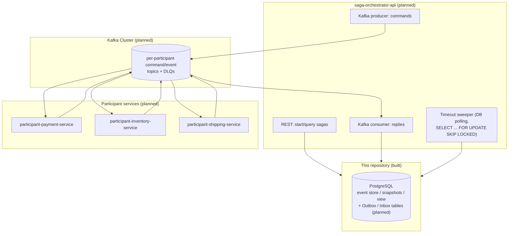
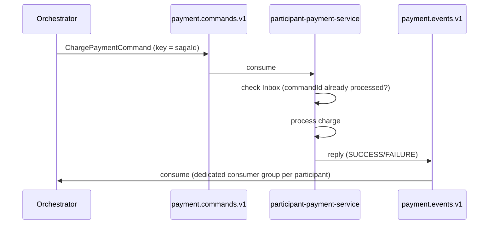
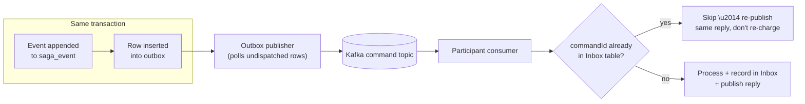

# Roadmap

## Status Summary

| Milestone | Scope | Status |
|---|---|---|
| 1 | Domain model: `SagaDefinition`, `SagaStep`, `SagaInstance` state machine, framework-free | ✅ Complete |
| 1.5 | Domain events, definition-by-reference, step correlation | ✅ Complete |
| 2 | Event sourcing over PostgreSQL: event store, snapshots, CQRS read model | ✅ Complete |
| 2.5 | Code-review fixes: atomic event-append + projection, snapshot failure isolation | ✅ Complete |
| 3 (architecture) | Kafka-based messaging design: topology, Outbox/Inbox, timeout handling, tracing | ✅ Architecture approved |
| 3 (implementation) | Building the above | 🚧 Not started in this repository |

**Everything under "Complete" is real, tested code in this repository — 41 unit tests (core) + 12 unit tests (postgres serialization) passing, plus Testcontainers integration tests for the PostgreSQL adapters.** Everything under Milestone 3 below is a reviewed and approved *design*, included here so the reasoning isn't lost — none of it is implemented yet.

---

## What's implemented

- Event-sourced saga aggregate (`SagaInstance`) with a validated state machine and a sealed, exhaustive domain event vocabulary
- Optimistic concurrency control, verified under real concurrent load
- CQRS read model (`saga_instance_view`), projected synchronously in the same transaction as the event append
- Snapshotting for fast rehydration, with schema-version-aware invalidation and independent failure isolation
- A PostgreSQL adapter module implementing every persistence port the core domain defines, with Flyway-style versioned migrations
- Full test suite: pure in-memory unit tests for the domain model, plus Testcontainers-backed integration tests for the real PostgreSQL adapters

## What's next: Milestone 3 — Distributed Messaging (Approved Architecture)

The next phase extends the orchestrator across process boundaries: a REST API, a Kafka-based command/reply protocol, and independent participant services (payment, inventory, shipping) that the orchestrator coordinates without them ever talking to each other directly.

**Non-negotiable constraint carried into this design:** the orchestrator remains the single coordinator. Participants never see each other's topics and never make cross-step decisions — any design choice that would let a participant infer or drive orchestration logic was rejected in review, even where it would have been simpler.

### Planned system architecture

### Planned Kafka messaging flow

### Planned Outbox / Inbox flow

Key decisions already resolved in architecture review (see the design log for full reasoning):

- **Per-participant Kafka topics**, not a shared topic — enforces ACL boundaries at the broker level, not just in application code.
- **Partition key = `sagaId`** — guarantees per-saga ordering structurally, via Kafka itself.
- **Independent consumer groups per participant reply topic** — isolates backpressure and rebalances; a slow shipping-reply consumer can never stall payment or inventory processing.
- **DB-polling timeout sweeper** using `SELECT ... FOR UPDATE SKIP LOCKED` — multi-replica-safe without leader election, transactionally consistent with the same Postgres instance already in use.
- **Protobuf** for message serialization — better schema-evolution guarantees than JSON, without requiring a Schema Registry as new standing infrastructure.
- **Outbox pattern** to solve the dual-write problem (DB commit succeeds, Kafka publish fails) now that Kafka is a second system alongside Postgres.
- **Inbox pattern**, both participant-side and orchestrator-side, to make Kafka's at-least-once delivery safe to process idempotently.

### Implementation order (once building resumes)

1. Outbox/Inbox tables, Protobuf contracts, Kafka producer/consumer abstraction (Messaging Foundation)
2. `saga-orchestrator-api`: REST endpoints, Kafka wiring, timeout sweeper
3. `participant-payment-service` as the reference participant implementation
4. `participant-inventory-service`, `participant-shipping-service` as near-mechanical repeats of the payment pattern
5. `saga-dashboard-api` — read-only queries against `saga_instance_view`
6. OpenTelemetry tracing across the full orchestrator → participant → orchestrator hop

## Future Improvements Beyond Milestone 3

- Confluent Schema Registry, if Protobuf's file-based schema governance ever needs centralized enforcement across independent teams
- Debezium/CDC-based Outbox publishing, if polling latency is ever measured as an actual bottleneck
- A genuinely broadcast `saga.lifecycle.events` topic for external consumers (analytics, notifications) — deliberately out of scope until a real second consumer exists
- Automatic DLQ replay tooling, once there's an operational need to point at
